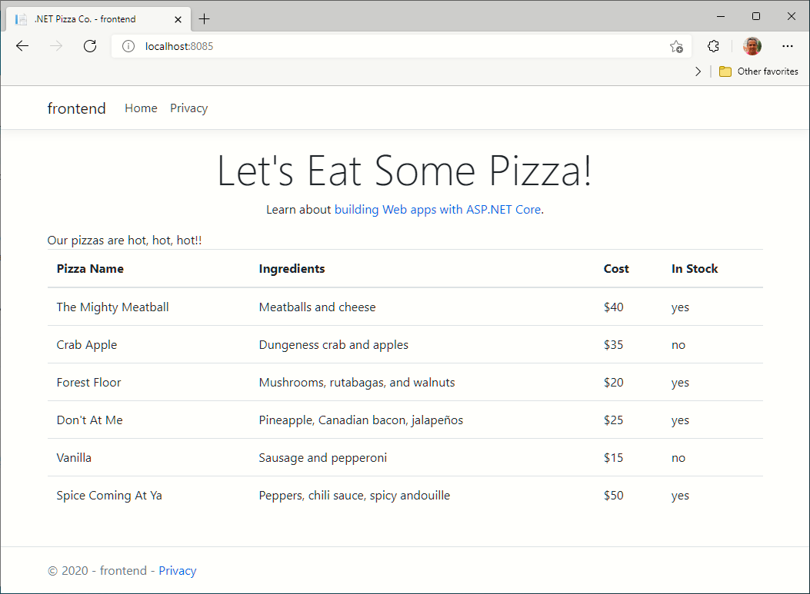
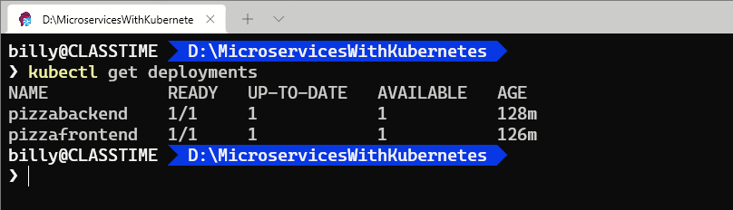
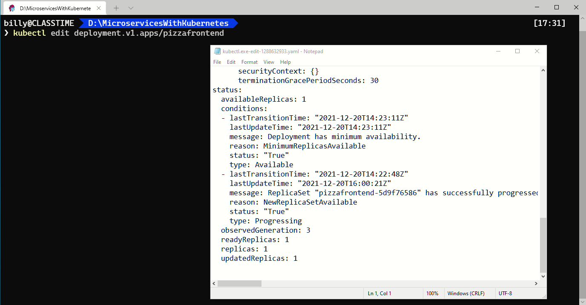
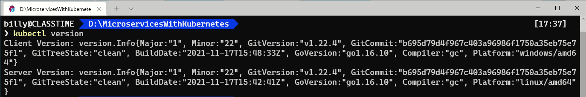
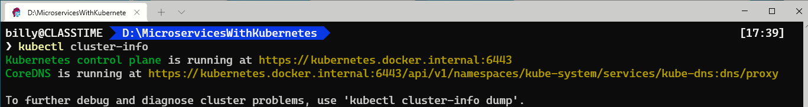
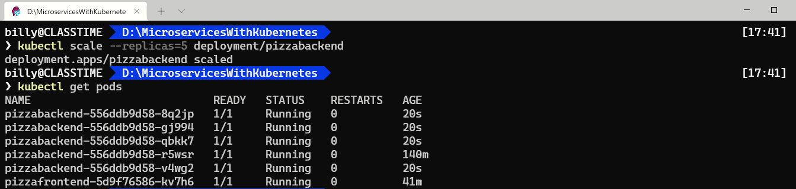
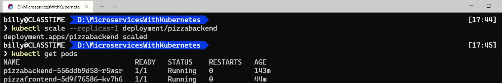
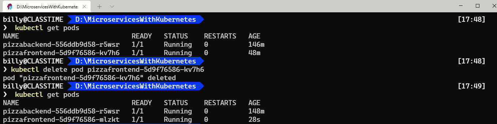

# Create microservice sith .Net and ASP.Net Core

1 - create a docker compose yaml file:

```yaml
version: '3.4'

services: 

  frontend:
    image: pizzafrontend
    build:
      context: frontend
      dockerfile: Dockerfile
    environment: 
      - backendUrl=http://backend
    ports:
      - "5902:8085"
    depends_on: 
      - backend
  backend:
    image: pizzabackend
    build: 
      context: backend
      dockerfile: Dockerfile
    ports: 
      - "5900:8085"
```

Ejecutar los siguientes comandos:

```docker-compose build```

```docker-compose up```

Para verificiar si ha quedado correcto usar un navegar y poner la siguiente dirección:

```http://localhost:5902```


# Conectamos a Docker Hub

```docker login ```

## Cargamos las imagenes a Docker Hub

1 - Primero etiquetamos

```bash
docker tag pizzafrontend billyclasstime/pizzafrontend
docker tag pizzabackend billyclasstime/pizzabackend
```

2 - Cargamos a Docker Hub

```
docker push billyclasstime/pizzafrontend
docker push billyclasstime/pizzabackend
```

# Creamos los despliegues en Kubernetes local

## Yaml para el despliegue del Backend

Creamos el fichero de despliegue del backend

```yaml
---
apiVersion: apps/v1
kind: Deployment
metadata:
  name: pizzabackend
spec:
  replicas: 1
  template:
    metadata:
      labels:
        app: pizzabackend
    spec:
      containers:
      - name: pizzabackend
        image: billyclasstime/pizzabackend:latest
        resources:
          limits:
            memory: "512Mi"
            cpu: "1000m"
        ports:
        - containerPort: 8085
        env:
        - name: ASPNETCORE_URLS
          value: http://*:8085
  selector:
    matchLabels:
      app: pizzabackend
---
apiVersion: v1
kind: Service
metadata:
  name: pizzabackend
spec:
  type: ClusterIP
  ports:
  - port: 8085
  selector:
    app: pizzabackend
```

Este archivo hace un par de cosas.

La primera parte define una especificación de implementación para el contenedor que se implementará en Kubernetes. Especifica que habrá una réplica, dónde encontrar la imagen del contenedor, qué puertos abrir en el contenedor y establece algunas variables de entorno. Esta primera parte también define etiquetas y nombres por los que se puede hacer referencia al contenedor y la especificación.

La segunda parte define que el contenedor se ejecutará como un ClusterIP de Kubernetes. Comprenda que este tipo de servicio no expone una dirección IP externa. Solo se puede acceder a él desde otros servicios que se ejecutan desde el mismo clúster de Kubernetes.

## Despliegue del microservicio de backend

```bash
kubectl apply -f backend-deploy.yml
```

Comprobamos el despliegue:

```powershell
kubectl get pods
```

Si navegaramos hacia esa dirección: ```http://localhost.8085``` el resultado sería un 404 not found, puesto que el backend aún no está disponible.

## Despliegue del microservicio de frontend

## Yaml para el despliegue del frontend

Creamos el siguiente fichero para el despliegue del frontend

```yaml
---
apiVersion: apps/v1
kind: Deployment
metadata:
  name: pizzafrontend
spec:
  replicas: 1
  template:
    metadata:
      labels:
        app: pizzafrontend
    spec:
      containers:
      - name: pizzafronend
        image: billyclasstime/pizzafrontend
        resources:
          limits:
            memory: "128Mi"
            cpu: "500m"
        ports:
        - containerPort: 8085
        env:
        - name: ASPNETCORE_URLS
          value: http://*:8085
        - name: backendUrl
          value: http://pizzabackend:8085
  selector:
    matchLabels:
      app: pizzafrontend
---
apiVersion: v1
kind: Service
metadata:
  name: pizzafrontend
spec:
  type: LoadBalancer
  ports:
  - port: 8085
  selector:
    app: pizzafrontend
```

Notará que este archivo es similar al que creamos para el microservicio de backend. 

Hay tres diferencias:

Estamos especificando un contenedor diferente para ejecutar bajo el valor ```spec.template.spec.containers.image``` de la implementación.

Hay una nueva variable de entorno en la sección ```spec.template.spec.containers.env```. 

El código en la aplicación pizzafrontend llama al backend, pero debido a que no hemos especificado un nombre de dominio completo ni conoceremos la dirección IP del microservicio de backend, usamos el nombre que especificamos en el nodo ```metadata.name``` de la implementación. Kubernetes se encargará del resto.
Y en la sección de servicio, estamos especificando un valor de LoadBalancer para  ```spec.type``` . Y el puerto 8085 está abierto para eso. Esto significa que podremos navegar por la interfaz de pizza navegando a http: // localhost:8085

## Despliegue del microservicio de frontend

```powershell
kubectl apply -f frontend-deploy.yml
```

Comprobamos el despliegue:

```powershell
kubectl get pods
```

Si navegaramos hacia esa dirección: ```http://localhost.8085``` el resultado sería lo siguiente



## Relanzando el despliegue

Cualquiera de los dos depliegues, el de backend o el de frontend, pueden ser relanzados o corregidos utilizando los siguientes comandos:

```kubectl get deployments```



Por ejemplo si queremos editar el despliegue del frontend usariamos el siguiente comando: ```kubectl edit deployment.v1.apps/pizzafrontend```



Si hacemos cualquier cambio y salvamos, un mensaje de que el despliegue ha sido "editado" deberá aparecer.

Para relanzar el despliegue con este cambio hacemos lo siguiente:

```kubectl rollout status deployment.v1.apps/pizzafrontend```

Un mensaje de que el despliegue ha sido actualizado deberá aparecer.

```
kubectl config view
```

Salida:


```
kubectl version
```

Salida:




```
kubectl cluster-info
```

Salida:




# Escalando una instancia del contenedor  en Kubernetes

Utilizamos el siguiente comando para escalar:

```
kubectl scale --replicas=5 deployment/pizzabackend
```

Verificamos con el siguiente comando:

```
kubectl get pods
```

Salida:




Utilizamos el siguiente comando para "des-escalar"

```
kubectl scale --replicas=1 deployment/pizzabackend
```

Verificamos con el siguiente comando:

```
kubectl get pods
```

Salida:




# Prueba de resilencia

Uno de los beneficios de Kubernetes es la compatibilidad con la gestión de configuración declarativa. Los servicios que defina en los archivos de configuración se conservarán a toda costa.

Esto significa que si hay una falla, Kubernetes reiniciará automáticamente los servicios que se estaban ejecutando antes de la falla.

Veamos esta resiliencia en acción eliminando el módulo de interfaz de pizza y luego verificando que Kubernetes lo haya reiniciado.

Usamos los comandos:

```
kubectl get pods
```

Borramos un pod:

```
kubectl delete pod pizzafrontend-5d9f76586-kv7h6
```

Usamos nuevamente el comando para ver el número de pods del cluster:

```
kubectl get pods
```

Salida:



Observe que la cadena aleatoria que sigue al nombre de pizzafrontend ha cambiado. Indicando que el pod es una nueva instancia. Además, el valor de AGE también es considerablemente menor.


# Resumen

Alojar microservicios en sus propios contenedores es un patrón común para el desarrollo basado en microservicios. No es raro tener muchos microservicios diferentes componiendo una sola aplicación. Intentar coordinar y mantener todos esos microservicios y sus contenedores manualmente puede abrumar rápidamente a una persona.

Un orquestador de contenedores es un sistema que implementa y administra automáticamente aplicaciones en contenedores. Kubernetes es una plataforma de código abierto extensible y portátil para administrar y orquestar cargas de trabajo en contenedores. Kubernetes abstrae las complejas tareas de administración de contenedores y le proporciona una configuración declarativa para organizar contenedores en diferentes entornos informáticos.

Aquí aprendió cómo tomar una aplicación .NET que ya estaba particionada en microservicios en contenedores e implementarla en un entorno de Kubernetes. Primero envió las imágenes de Docker a Docker Hub, para que las imágenes estuvieran disponibles en la instancia de Kubernetes para su descarga, y luego creó archivos de implementación para describir declarativamente lo que Kubernetes debería hacer con cada microservicio. También aprendió lo sencillo que es escalar un microservicio en contenedores con Kubernetes.